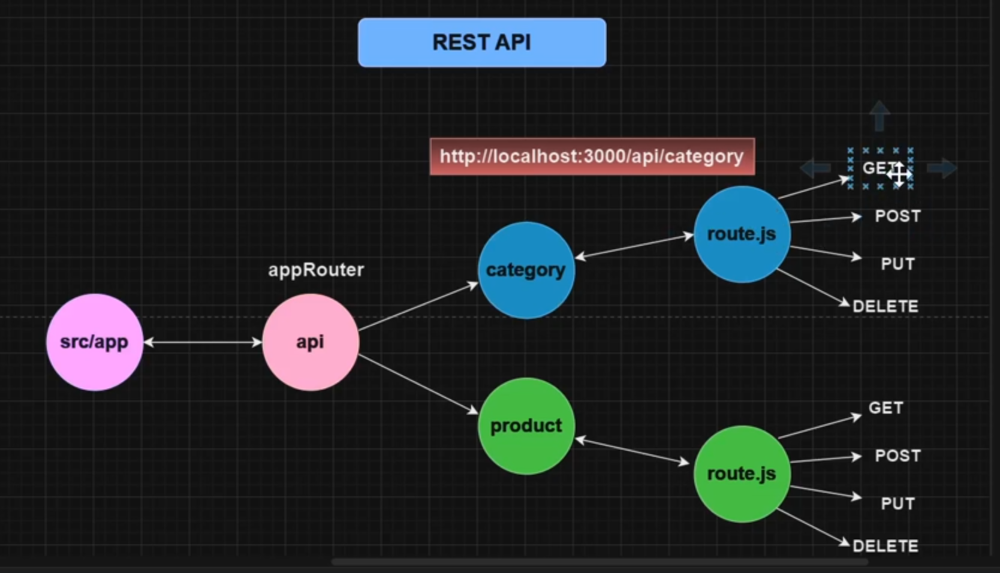

# NextAPI

NextAPI is a project that aims to demonstrate how to build a REST API using [insert technology/framework here]. 

## Getting Started

To get started with NextAPI, follow the steps below:

1. Clone the repository: `git clone https://github.com/allglenn/nextapi.git`
2. Install the dependencies: `npm install`
3. Configure the database connection in the `config.js` file.
4. Start the server: `npm start`

## API Endpoints

# NextAPI Documentation

NextAPI provides the following API endpoints for managing categories and products:

## Category Endpoints

- `GET /api/category`: Retrieves a list of all categories.
- `POST /api/category`: Creates a new category.
- `PUT /api/category/:id`: Updates an existing category.
- `DELETE /api/category/:id`: Deletes a category.

## Product Endpoints

- `GET /api/product`: Retrieves a list of all products.
- `POST /api/product`: Creates a new product.
- `PUT /api/product/:id`: Updates an existing product.
- `DELETE /api/product/:id`: Deletes a product.

For detailed information on each endpoint, refer to the [API documentation](/docs/api.md).

## Contributing

We welcome contributions to NextAPI! If you would like to contribute, please follow our [contribution guidelines](/CONTRIBUTING.md).

## License

NextAPI is licensed under the [MIT License](/LICENSE).
